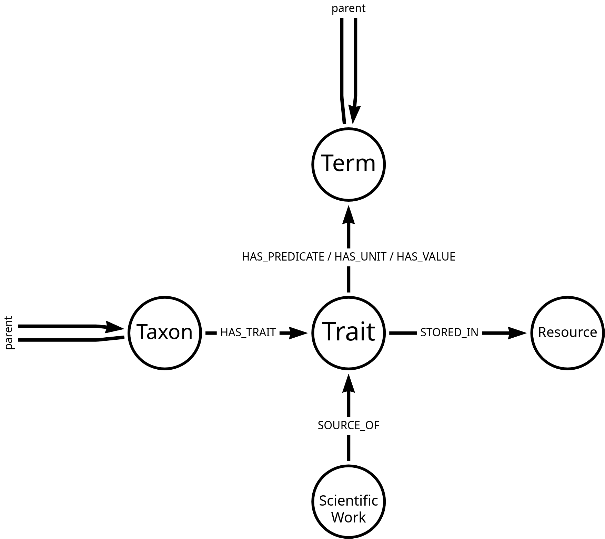

---
---

:warning: Work In Progress

TraitBank provides access to traits (e.g., bodysize, lifespan) of organisms.

TraitBank's data model consist of roughly five kinds of things: traits, terms, taxa, scientiic works and resources. Traits describe terms and their values associated with specific taxa as stored in digital references and described in scientific works.

[](https://arrows.app/#/import/json=eyJncmFwaCI6eyJub2RlcyI6W3siaWQiOiJuMTYiLCJwb3NpdGlvbiI6eyJ4IjotMTcwLjUxMDQ5ODc2OTAyNDYyLCJ5Ijo1MzMuODAwOTUxMDMwNTU4NX0sImNhcHRpb24iOiJUcmFpdCIsImxhYmVscyI6W10sInByb3BlcnRpZXMiOnt9LCJzdHlsZSI6e319LHsiaWQiOiJuMTkiLCJwb3NpdGlvbiI6eyJ4IjotMTcwLjUxMDQ5ODc2OTAyNDY4LCJ5IjoyODguOTM2NjIxNzU2OTU1NTZ9LCJjYXB0aW9uIjoiVGVybSIsImxhYmVscyI6W10sInByb3BlcnRpZXMiOnt9LCJzdHlsZSI6e319LHsiaWQiOiJuMjIiLCJwb3NpdGlvbiI6eyJ4IjotNDM3LjExMzkwNzE5MTQ1ODYsInkiOjUzMy44MDA5NDY4NzcxOTJ9LCJjYXB0aW9uIjoiVGF4b24iLCJsYWJlbHMiOltdLCJwcm9wZXJ0aWVzIjp7fSwic3R5bGUiOnt9fSx7ImlkIjoibjI1IiwicG9zaXRpb24iOnsieCI6LTE3MC41MTA0OTg3NjkwMjQ2MiwieSI6Nzc4LjY2NTI4MDMwNDE2MTV9LCJjYXB0aW9uIjoiU2NpZW50aWZpYyBXb3JrIiwibGFiZWxzIjpbXSwicHJvcGVydGllcyI6e30sInN0eWxlIjp7fX0seyJpZCI6Im4zNiIsInBvc2l0aW9uIjp7IngiOjE0Ny4xNDIyNTY2ODQ2MTEyMywieSI6NTMzLjgwMDk1NTk3OTIxMzV9LCJjYXB0aW9uIjoiUmVzb3VyY2UiLCJsYWJlbHMiOltdLCJwcm9wZXJ0aWVzIjp7fSwic3R5bGUiOnt9fV0sInJlbGF0aW9uc2hpcHMiOlt7ImlkIjoibjUxIiwiZnJvbUlkIjoibjE2IiwidG9JZCI6Im4xOSIsInR5cGUiOiJIQVNfUFJFRElDQVRFIC8gSEFTX1VOSVQgLyBIQVNfVkFMVUUiLCJwcm9wZXJ0aWVzIjp7fSwic3R5bGUiOnsiZGV0YWlsLW9yaWVudGF0aW9uIjoicGVycGVuZGljdWxhciJ9fSx7ImlkIjoibjUyIiwiZnJvbUlkIjoibjIyIiwidG9JZCI6Im4xNiIsInR5cGUiOiJIQVNfVFJBSVQiLCJwcm9wZXJ0aWVzIjp7fSwic3R5bGUiOnt9fSx7ImlkIjoibjY4IiwiZnJvbUlkIjoibjE2IiwidG9JZCI6Im4zNiIsInR5cGUiOiJTVE9SRURfSU4iLCJwcm9wZXJ0aWVzIjp7fSwic3R5bGUiOnt9fSx7ImlkIjoibjY5IiwiZnJvbUlkIjoibjI1IiwidG9JZCI6Im4xNiIsInR5cGUiOiJTT1VSQ0VfT0YiLCJwcm9wZXJ0aWVzIjp7fSwic3R5bGUiOnsiZGV0YWlsLW9yaWVudGF0aW9uIjoiaG9yaXpvbnRhbCJ9fSx7ImlkIjoibjcwIiwiZnJvbUlkIjoibjE5IiwidG9JZCI6Im4xOSIsInR5cGUiOiJwYXJlbnQiLCJwcm9wZXJ0aWVzIjp7fSwic3R5bGUiOnt9fSx7ImlkIjoibjcxIiwiZnJvbUlkIjoibjIyIiwidG9JZCI6Im4yMiIsInR5cGUiOiJwYXJlbnQiLCJwcm9wZXJ0aWVzIjp7fSwic3R5bGUiOnt9fV0sInN0eWxlIjp7ImZvbnQtZmFtaWx5Ijoic2Fucy1zZXJpZiIsImJhY2tncm91bmQtY29sb3IiOiIjZmZmZmZmIiwiYmFja2dyb3VuZC1pbWFnZSI6IiIsImJhY2tncm91bmQtc2l6ZSI6IjEwMCUiLCJub2RlLWNvbG9yIjoiI2ZmZmZmZiIsImJvcmRlci13aWR0aCI6NCwiYm9yZGVyLWNvbG9yIjoiIzAwMDAwMCIsInJhZGl1cyI6NTAsIm5vZGUtcGFkZGluZyI6NSwibm9kZS1tYXJnaW4iOjIsIm91dHNpZGUtcG9zaXRpb24iOiJhdXRvIiwibm9kZS1pY29uLWltYWdlIjoiIiwibm9kZS1iYWNrZ3JvdW5kLWltYWdlIjoiIiwiaWNvbi1wb3NpdGlvbiI6Imluc2lkZSIsImljb24tc2l6ZSI6NjQsImNhcHRpb24tcG9zaXRpb24iOiJpbnNpZGUiLCJjYXB0aW9uLW1heC13aWR0aCI6MjAwLCJjYXB0aW9uLWNvbG9yIjoiIzAwMDAwMCIsImNhcHRpb24tZm9udC1zaXplIjo1MCwiY2FwdGlvbi1mb250LXdlaWdodCI6Im5vcm1hbCIsImxhYmVsLXBvc2l0aW9uIjoiaW5zaWRlIiwibGFiZWwtZGlzcGxheSI6InBpbGwiLCJsYWJlbC1jb2xvciI6IiMwMDAwMDAiLCJsYWJlbC1iYWNrZ3JvdW5kLWNvbG9yIjoiI2ZmZmZmZiIsImxhYmVsLWJvcmRlci1jb2xvciI6IiMwMDAwMDAiLCJsYWJlbC1ib3JkZXItd2lkdGgiOjQsImxhYmVsLWZvbnQtc2l6ZSI6NDAsImxhYmVsLXBhZGRpbmciOjUsImxhYmVsLW1hcmdpbiI6NCwiZGlyZWN0aW9uYWxpdHkiOiJkaXJlY3RlZCIsImRldGFpbC1wb3NpdGlvbiI6ImlubGluZSIsImRldGFpbC1vcmllbnRhdGlvbiI6InBhcmFsbGVsIiwiYXJyb3ctd2lkdGgiOjUsImFycm93LWNvbG9yIjoiIzAwMDAwMCIsIm1hcmdpbi1zdGFydCI6NSwibWFyZ2luLWVuZCI6NSwibWFyZ2luLXBlZXIiOjIwLCJhdHRhY2htZW50LXN0YXJ0Ijoibm9ybWFsIiwiYXR0YWNobWVudC1lbmQiOiJub3JtYWwiLCJyZWxhdGlvbnNoaXAtaWNvbi1pbWFnZSI6IiIsInR5cGUtY29sb3IiOiIjMDAwMDAwIiwidHlwZS1iYWNrZ3JvdW5kLWNvbG9yIjoiI2ZmZmZmZiIsInR5cGUtYm9yZGVyLWNvbG9yIjoiIzAwMDAwMCIsInR5cGUtYm9yZGVyLXdpZHRoIjowLCJ0eXBlLWZvbnQtc2l6ZSI6MTYsInR5cGUtcGFkZGluZyI6NSwicHJvcGVydHktcG9zaXRpb24iOiJvdXRzaWRlIiwicHJvcGVydHktYWxpZ25tZW50IjoiY29sb24iLCJwcm9wZXJ0eS1jb2xvciI6IiMwMDAwMDAiLCJwcm9wZXJ0eS1mb250LXNpemUiOjE2LCJwcm9wZXJ0eS1mb250LXdlaWdodCI6Im5vcm1hbCJ9fSwiZGlhZ3JhbU5hbWUiOiJUcmFpdEJhbmsifQ==)
